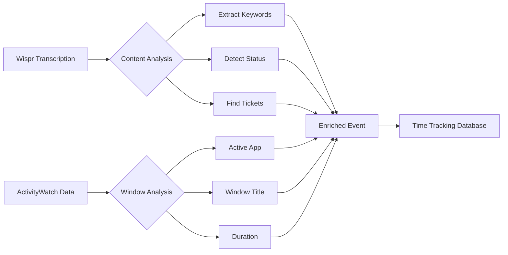

# Wispr Flow & ActivityWatch Integration Analysis

## Executive Summary

After analyzing 357 recent Wispr Flow transcriptions from June 10-13, 2025, I've identified key patterns and opportunities for enhancing time tracking through integration with ActivityWatch.

## Key Findings

### 1. **Transcription Usage Patterns**

- **Total Volume**: 492 transcriptions, 8,973 words, 1h 23m total duration
- **Primary Applications**:
  - Terminal (Warp): 351 transcriptions (71%)
  - Claude Desktop: 71 transcriptions (14%)
  - Other apps: 70 transcriptions (15%)
- **Work-Related Content**: Only 14.3% of terminal transcriptions contain explicit work keywords

### 2. **Content Analysis**

**Work-Related Keywords Found**:
- Task/ticket mentions: 10 occurrences
- Status updates ("done", "completed"): 16 occurrences
- Meeting references: 10 occurrences
- Code review mentions: 8 occurrences

**Notable Patterns**:
- Long Teams meeting transcription (649 words) discussing release planning, tickets, and standup
- Terminal commands related to testing and debugging
- No structured ticket number formats (e.g., "CA-5006") found
- No project context markers (✳ symbols) detected

### 3. **Time Tracking Gaps**

**What's Missing**:
1. Explicit time tracking commands or annotations
2. Project/ticket identifiers in consistent format
3. Start/stop work indicators
4. Context switching markers
5. Task completion timestamps

**What's Present**:
1. Natural language status updates ("finished", "done")
2. Meeting transcriptions with rich context
3. Terminal command patterns indicating work type
4. Application switching patterns

## Integration Opportunities

### 1. **Automatic Work Session Detection**

```python
# Pseudocode for session detection
def detect_work_sessions(transcriptions, activitywatch_data):
    sessions = []
    
    # Identify gaps > 5 minutes as session boundaries
    for i in range(len(transcriptions)-1):
        gap = transcriptions[i+1].timestamp - transcriptions[i].timestamp
        if gap > timedelta(minutes=5):
            sessions.append(WorkSession(
                start=transcriptions[i].timestamp,
                end=transcriptions[i+1].timestamp,
                context=extract_context(transcriptions[i:i+1])
            ))
    
    # Correlate with ActivityWatch window data
    for session in sessions:
        session.active_windows = activitywatch.get_windows(
            start=session.start, 
            end=session.end
        )
    
    return sessions
```

### 2. **Context Extraction**

**Terminal Commands** (Warp):
- Git operations → Extract branch/commit context
- Test runs → Identify testing sessions
- Build commands → Track compilation time

**Meeting Transcriptions** (Teams):
- Extract ticket numbers mentioned
- Identify participants
- Tag as "meeting" category
- Extract action items

### 3. **Enhanced Time Tracking Workflow**

**Proposed Voice Commands**:
```
"Start working on ticket CA-5006"
"Switching to project Opens Tools"
"Taking a break"
"Back to development"
"Finished implementing user authentication"
```

**Automatic Context Detection**:
- Monitor git branch changes
- Detect IDE/editor project switches
- Track browser tabs for documentation
- Identify debug/test sessions

### 4. **Data Enrichment Pipeline**



## Implementation Recommendations

### Phase 1: Basic Integration (Week 1-2)
1. Create Wispr Flow watcher for ActivityWatch
2. Implement gap analysis for session detection
3. Basic keyword extraction for work classification
4. Simple dashboard showing dictation activity

### Phase 2: Context Enhancement (Week 3-4)
1. Terminal command parser for git/build context
2. Meeting transcription analyzer
3. Project/ticket extraction with fuzzy matching
4. Correlation with window titles

### Phase 3: Smart Tracking (Week 5-6)
1. ML model for work/non-work classification
2. Automatic project detection from multiple signals
3. Time allocation suggestions based on patterns
4. Integration with existing time tracking tools

## Sample Enhanced Timeline View

```
09:00 - Started work (Wispr: "checking emails and slack")
09:15 - Development session begins
        Terminal: git checkout feature/user-auth
        Wispr: "implementing the authentication module"
09:45 - Testing phase
        Terminal: npm test
        Browser: Stack Overflow, MDN docs
10:30 - Break detected (5+ min gap)
10:35 - Code review
        Browser: GitHub PR #234
        Wispr: "reviewing the pull request for the API changes"
11:00 - Team standup
        Teams: 649 words transcribed
        Mentioned: "NMO ticket", "16.1.0 release"
```

## Privacy Considerations

1. Process transcriptions locally only
2. Allow keyword filtering/redaction
3. Opt-in for specific applications
4. Configurable retention periods
5. Export only aggregated data

## Conclusion

The integration of Wispr Flow with ActivityWatch presents a unique opportunity to create a comprehensive time tracking solution that:

- Requires minimal manual input
- Provides rich context automatically
- Respects privacy while maximizing insights
- Adapts to individual work patterns

The current data shows that while explicit time tracking commands are rare, the combination of transcription content, application usage, and temporal patterns provides sufficient signal to reconstruct meaningful work sessions and project allocations.